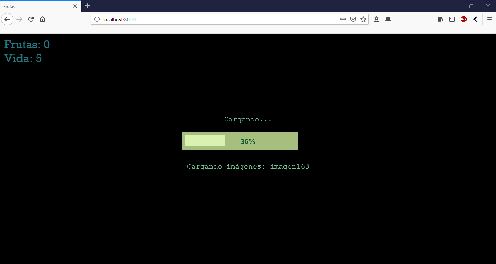
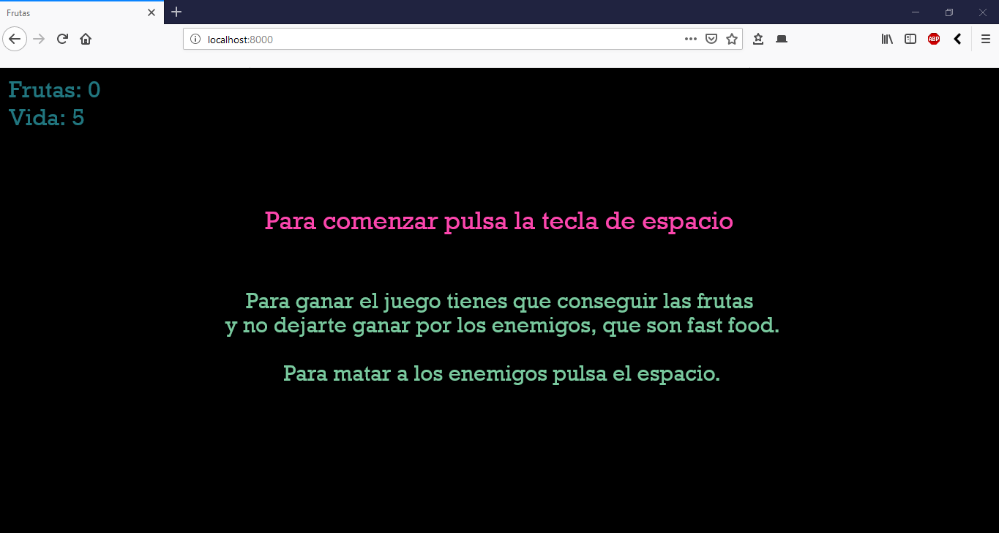
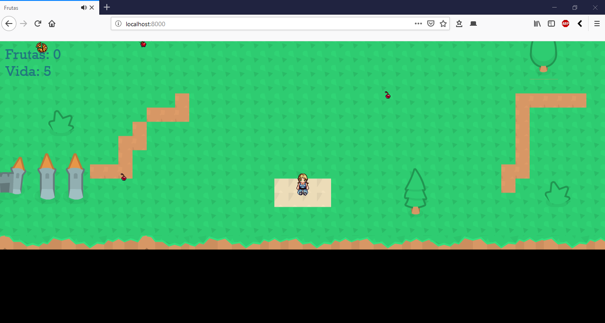
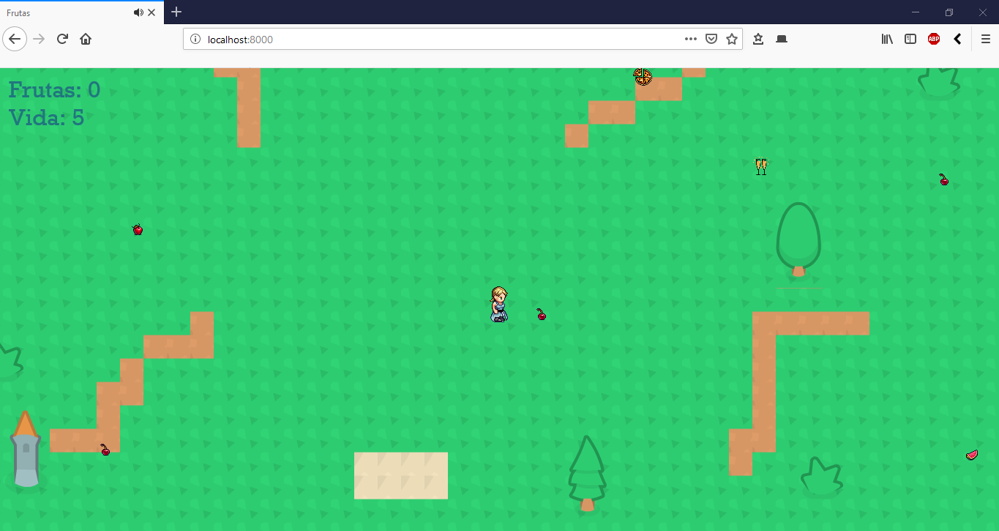
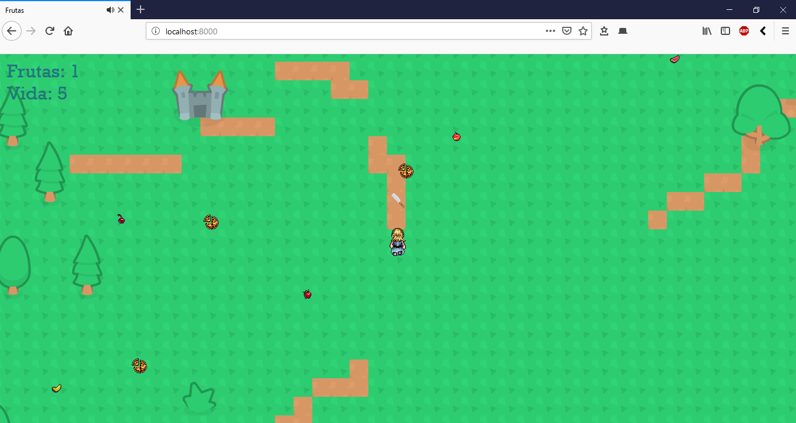
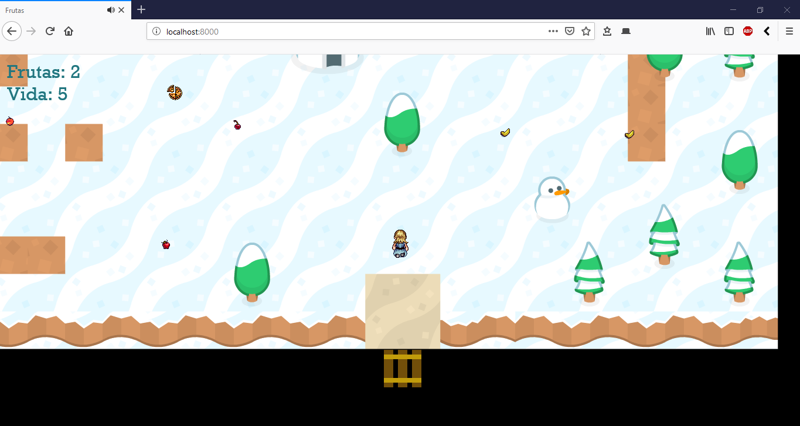
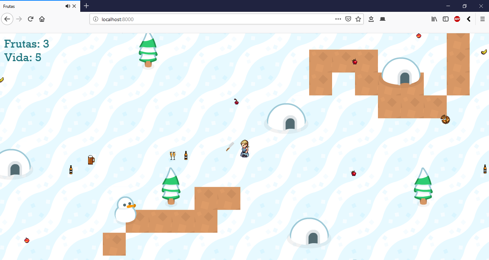
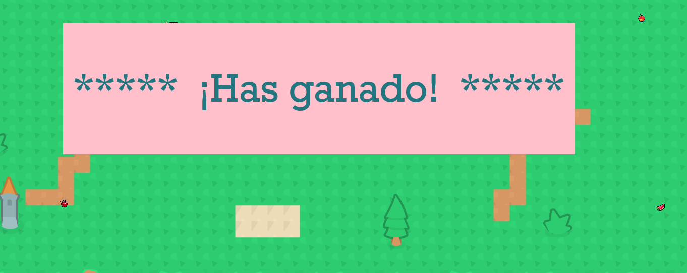
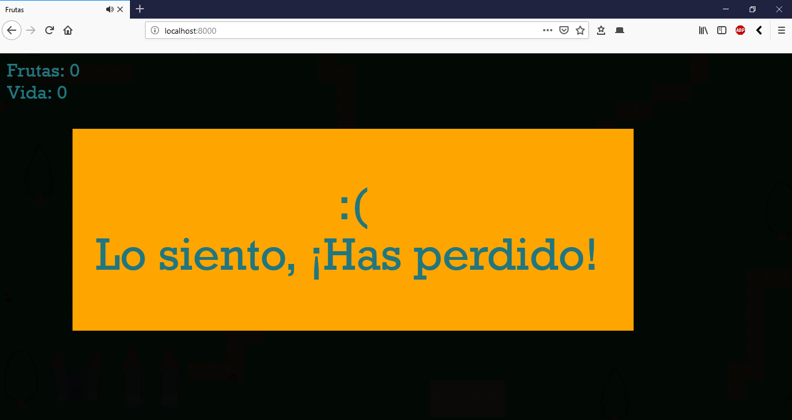

# juego-Phaser3
Pequeño juego con phaser3, nodeJS, ES6, webpack

**Juego realizado con Phaser 3, nodeJS, ES& y webpack**

El juego consiste en conseguir que la muñeca consiga 100 frutas y no se deje mata por la comida basura, disparando cuchillos al pulsar el espacio.

## Capturas del juego

Precarga

 

Iniciar el juego

 

Juego. Nivel 1

 

Juego

 

Jugador lanzando cuchillos al pulsar espacio

 

Juego. Nivel 2

 

Juegador lanzando cuchillos.

 

Mensaje de victoria

 

Mensaje de derrota.

 